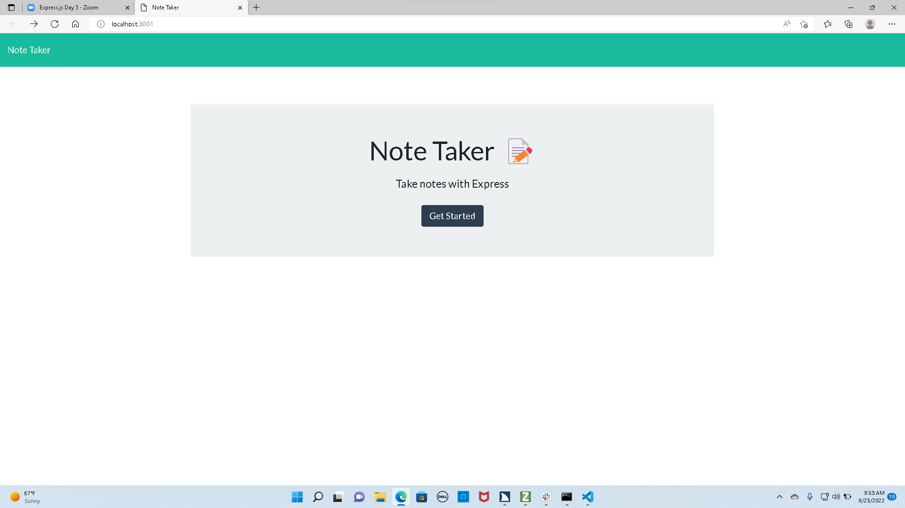
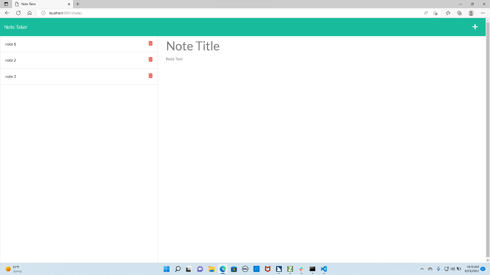

# Note Taker: 11 Express.js

**Description** 
 This application uses an Express.js back end and will save and retrieve note data from a JSON file.

 **Accessing repo**
 go to [my repo](https://github.com/teshome28sara/11-Express-note-taker)

## My task 
**As a coding bootcamp student, my assignment was to modify starter code to create an application 
    called Note Taker that can be used to write and save notes. This application  uses an Express.js back end and  saves and retrieves note data from a JSON file.**

## Acceptance Criteria

✔️ When  I open the Note Taker
then  I am presented with a landing page with a link to a notes page.

✔️ When  I click on the link to the notes page
then I am presented with a page with existing notes listed in the left-hand column, plus empty fields to enter a new note title and the note’s text in the right-hand column

✔️ When  I enter a new note title and the note’s text
then a Save icon appears in the navigation at the top of the page

✔️ When I click on the Save icon
then the new note I have entered is saved and appears in the left-hand column 

✔️ When I click on an existing note in the list in the left-hand column
then that note appears in the right-hand column

✔️ When I click on the Write icon in the navigation at the top of the page
then I am presented with empty fields to enter a new note title and the note’s text in the right-hand column 

## Heroku deployed app URL 

 https://sheltered-waters-51444.herokuapp.com/ deployed to Heroku

  ## Application screenshots 

   

    
